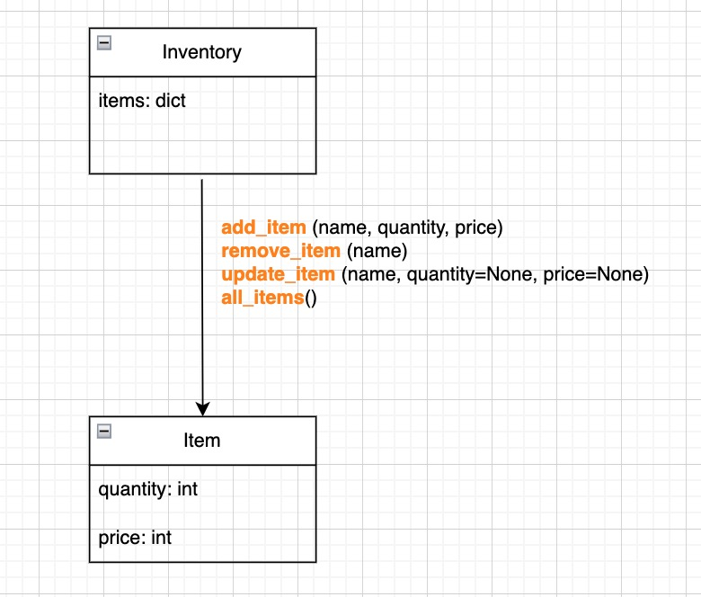

## Assignment - Option 1: Coding
Design and build a simple inventory service. The inventory stores items. Items should have a name,
a quantity, and a price. The service should be able to list all the items in the inventory and have
a way to add and remove items and to update their details. You need to develop an initial mock
implementation of the service using your preferred programming language.

 
## Description of the main features

The inventory service provides a simple way to manage items and their details. The service is designed to store items, each having a name, a quantity, and a price. The Inventory class is the main component of the service, and it has four methods to manage items: add_item, remove_item, update_item, and all_items.

The add_item() method adds a new item to the inventory. It takes three parameters: name, quantity, and price. If the item with the same name already exists in the inventory, the method will print "Item {name} is already exists. Use update_item for updating" and do nothing. Otherwise, it will add the item to the inventory with the given quantity and price and print "Item {name} successfully added".

The remove_item() method removes an item from the inventory by its name. If the item is found, it will be removed from the inventory and the method will print "Item {name} successfully removed". If the item is not found, the method will print "Item {name} was not found".

The update_item() method updates an existing item in the inventory. It takes three parameters: name, quantity, and price. If the item with the given name is found, the method will update its quantity and/or price if they are provided, and print "Item {name} successfully updated". If the item is not found, the method will print "Item {name} was not found".

The all_items() method lists all the items in the inventory with their names, quantities, and prices. It iterates over the dictionary of items stored in the Inventory class and prints their details in the format "name: quantity x price".

## High-level overview diagram

The diagram shows the high-level overview of an inventory service. 

